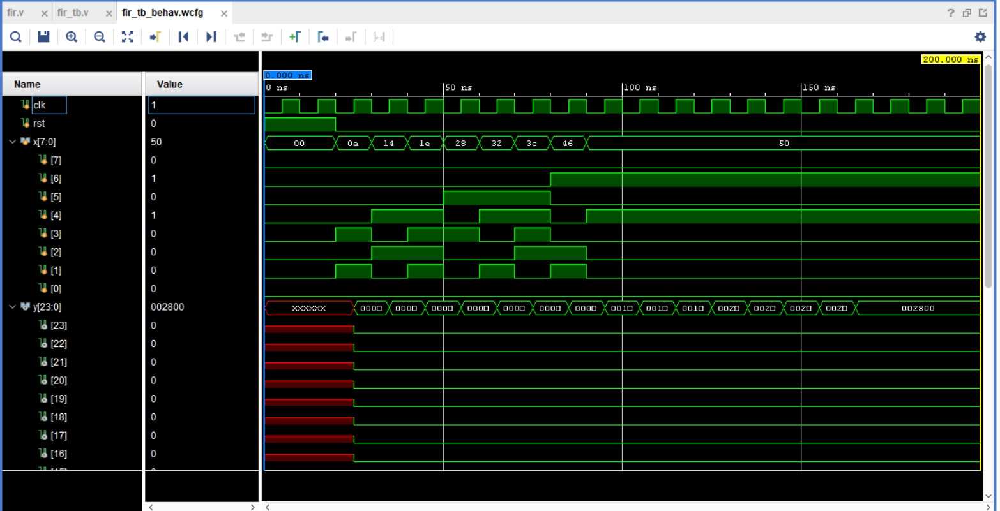

# FIR Filter Implementation (Verilog)

This project features a digital Finite Impulse Response (FIR) filter implemented in Verilog. The design utilizes a tapped-delay line architecture to perform real-time signal processing, calculating the weighted sum of input samples based on predefined coefficients.

## Project Overview

The design is optimized for FPGA implementation and modular signal processing tasks.

* **`fir_filter`**: The core module containing the filter logic. It implements an 8-tap structure using `parameter` definitions for filter coefficients (`h0` through `h7`) and a series of registers to maintain the history of input samples.
* **`fir_tb`**: A testbench module used to verify the filter's functionality. It drives the clock, reset, and a series of input values (`x`) into the filter and monitors the output (`y`) to ensure the convolution logic performs as expected.

## Simulation Result

The following waveform illustrates the filter response as input data passes through the delay line and the output `y` is computed.

## Getting Started

### Prerequisites
* A Verilog-compatible simulator (e.g., Vivado XSim, ModelSim, or Icarus Verilog).

### How to Run
1.  Include `fir.v` and `fir_tb.v` in your simulation environment.
2.  Set `fir_tb` as the top-level module.
3.  Execute the simulation. The `$monitor` task in the testbench will output the filter's performance in real-time to the simulation console, showing the input samples and the resulting filtered output.
